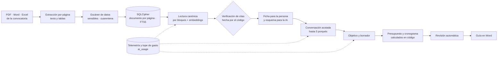
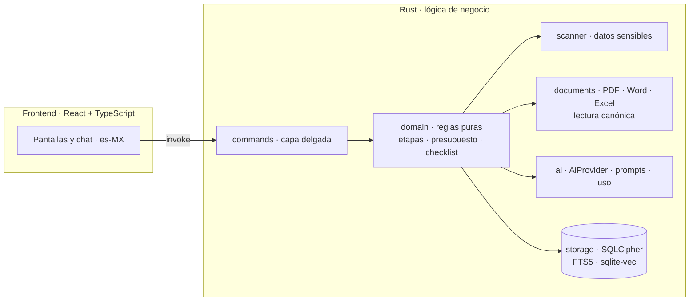

# Cimiento

**Un pipeline de datos para el tercer sector: convierte convocatorias de donativos (PDF no estructurados) y las ideas sueltas de una institución en un proyecto bien planteado, con presupuesto que cuadra y una guía lista para entregar. Local, auditable y con el gasto de IA bajo control.**

> **In English.** Cimiento is a local-first desktop app (Tauri 2 + Rust + React/TypeScript, encrypted SQLite) built as an **automated, bounded data pipeline** for small Mexican charities applying for grants. Unstructured grant-call PDFs go in; a schema-validated, citation-verified summary, a guided diagnostic, a computed budget and a Word guide come out. Its core is a **canonical JSON Schema** (the same contract for any funder, no per-format rules) that a small, cheap model fills in with page citations that **code, not the model, verifies**; and a **five-whys diagnostic** that bounds the conversation so it reaches the root cause without wandering or running up costs. It is designed around data engineering concerns: **data contracts** (JSON Schema at every LLM boundary), **lineage** (every field records its origin and confirmation), **privacy by design** (PII scanner on both sides of the model, only aggregates reach the LLM, individual records never leave the machine), **cost governance** (per-model rate limits, monthly cap, one AI process per project, bounded conversations) and **measure-first decisions** (model choice, reproducibility and architecture were settled with small experiments, documented in 24 ADRs). The LLM never calculates and never writes files. 413 Rust + 95 frontend tests, all green. Working beta, used by two real charities on their everyday grant calls (JAP and JAPEM, plus Monte de Piedad, Alsea and Bienestar in testing). UI and docs are in Spanish. Source-available for evaluation, not open source (see [License](#licencia)).

    

## Contexto del proyecto

Cimiento es el proyecto de **servicio social** de su autor, ingeniero en Sistemas, y la **inspiración de su tesis** de titulación. Es un problema real, con instituciones reales que lo usan, y por eso reúne en un solo lugar las habilidades de ingeniería de sistemas (arquitectura por capas, pruebas, decisiones documentadas en ADRs) y de ingeniería de datos (contratos de datos, linaje, privacidad y control de costo de IA).

## De dónde sale la idea

Las instituciones de asistencia privada (asilos, casas hogar) pierden donativos no porque no los necesiten, sino porque tienen un problema de **datos y de información**:

- Cada donante publica sus reglas en un formato distinto: PDF largos, anexos en Word y Excel, tablas, fechas dispersas y requisitos que a veces se contradicen entre documentos.
- Su propia información está dispersa; cada convocatoria empieza de cero.
- Les cuesta pasar de «arreglar un baño» a «un espacio seguro para 18 adultos mayores», que es lo que el donante sí financia.

Visto como análisis de datos, es un problema de **extracción, estructuración, validación y decisión** sobre fuentes no estructuradas, con usuarios sin perfil técnico y con datos sensibles alrededor. Cimiento nace de ahí, y su arquitectura responde a cada una de esas restricciones.

## Principios de diseño

| Principio | Qué significa en la práctica |
|---|---|
| **Pipeline automatizado y acotado** | Cada etapa tiene entrada, salida y condición de avance definidas. Nada queda «suelto»: el flujo es una máquina de etapas, no un chat abierto. |
| **El código hace lo pesado, la IA lo ligero** | Cálculos, validaciones, lectura y escritura de archivos son deterministas. La IA pregunta, razona y redacta, y su salida siempre es JSON validado contra un esquema. |
| **Contratos de datos en cada frontera** | JSON Schema versionado en el esquema canónico de convocatorias y en cada tarea de IA; migraciones numeradas y prompts versionados como archivos. |
| **Linaje de datos** | Todo dato lleva su origen (`user`, `document`, `ai_assumption`, `computed`) y su fecha de confirmación. Lo que propone la IA nunca cuenta como hecho hasta que una persona lo confirma. |
| **Privacidad y ética por diseño** | Local primero, cifrado, «cuántos, nunca quiénes», escáner antes y después del modelo. Ver [Ética y privacidad](#ética-y-privacidad-por-diseño). |
| **Medir antes de decidir** | Las decisiones de modelo, costo y arquitectura salieron de experimentos pequeños y quedaron documentadas, incluidas las que salieron mal. Ver [Análisis](#el-análisis-detrás-de-las-decisiones). |
| **Diseñado para quien no es técnico** | Lenguaje sencillo, chat guiado, un paso a la vez, y errores que nunca inventan una respuesta. Ver [UX](#ux-para-un-entorno-no-técnico). |

## El pipeline



| Etapa | Entrada → salida | Control |
|---|---|---|
| Extracción | PDF/Word/Excel → texto por página y filas de tabla | Tablas por líneas de dibujo (`pdf_grid`) o por posición del texto (`pdf_rows`); descarta rejillas que son pie de página o marcos |
| Escáner | Texto → texto limpio o cuarentena | Patrones con dígitos verificadores, positivos y negativos probados; corre otra vez sobre el prompt completo antes de salir |
| Lectura canónica | Páginas → documento JSON con citas | Esquema versionado; recuperación semántica por bloque; una segunda pasada sobre lo poco citado |
| Verificación | Cada afirmación → verificada o descartada | **El código** comprueba que la cita exista en la página; lo que no, se descarta y se lista |
| Conversación | Palabras de la persona → causa de fondo | Máximo 5 porqués, cita verificada, confirmación explícita |
| Presupuesto y cronograma | Partidas y fechas → totales y validaciones | Solo código: la IA no calcula, y las cifras que escribe se revisan contra lo dicho |
| Revisión y guía | Proyecto → errores que bloquean, avisos y Word | Escaneo previo al archivo; el original nunca se modifica |

## El esquema canónico: un contrato para cualquier convocatoria

La pieza central de la extracción es [`schemas/canonical_call.schema.json`](schemas/canonical_call.schema.json) (JSON Schema 2020-12, ≈ 45 KB): **un contrato universal que fija qué información hace falta de toda convocatoria, sin decir dónde ni cómo está escrita**. Nosotros definimos qué necesitamos; el modelo lo busca y lo rellena; el código verifica y normaliza. Por eso cualquier modelo, barato o caro, responde al mismo contrato ([ADR-015](docs/adr/ADR-015-schema-canonico-de-convocatorias.md)).

| Bloque | Qué recoge |
|---|---|
| `metadatos` | Origen y trazabilidad. Lo llena el código, nunca el modelo |
| `identidad` · `temporalidad` | Quién convoca, de qué tipo es el documento y el calendario como lista de hitos con tipo cerrado |
| `elegibilidad` · `financiamiento` | Quién puede participar; montos, topes y contrapartida por modalidad |
| `proyecto` · `documentacion` | Qué se puede financiar y qué documentos se piden |
| `evaluacion` · `entrega` | Cómo se califica y cómo se entrega |
| `conflictos` · `otros_hallazgos` · `dudas` | Contradicciones entre documentos, una válvula para lo que ningún campo prevé y lo que queda por confirmar |

Las reglas del contrato son las que lo hacen **agnóstico y preciso a la vez**:

1. **Cada dato es su cita.** Cita literal, página y documento; el código comprueba que exista. El texto lo pone la cita, no el modelo.
2. **`no_aparece` y `ambiguo` son respuestas válidas.** Un campo vacío siempre dice por qué, y las reglas del esquema impiden inventar evidencia donde no la hay.
3. **El modelo señala, el código normaliza.** Fechas, montos, porcentajes y duraciones los convierte el código desde la cita.
4. **Un paquete de documentos, no un PDF.** Una convocatoria suele ser un PDF más anexos en Word y Excel que se remiten entre sí; si se contradicen, el esquema guarda **todas** las versiones y el código no elige.
5. **Agnóstico por diseño.** Ninguna descripción de campo nombra una institución, un formato ni las palabras de un donante.

Cómo se ejecuta: el paquete se numera por páginas, cada bloque del esquema es una consulta, se recuperan las páginas relevantes por significado (embeddings) fusionadas con un ranking léxico, y el modelo rellena **un bloque por llamada**. Esa forma de leer salió de una medición: una API de IA rechazaba el esquema completo con salida estructurada cuando llevaba cuatro o más bloques (un límite de complejidad, no de tamaño). Se comparó una sola llamada contra lectura por bloques en siete paquetes de documentos, y la lectura por bloques con embeddings dio la mejor cobertura (38 de 42 hechos verificados a mano en uno de los donantes) con un costo moderado. Una segunda pasada relee lo poco citado.

## Los cinco porqués: delimitar para precisar

El diagnóstico no es un chat abierto: es una **estructura que delimita la conversación** para llegar a la causa de fondo y no irse a temas que no importan. Se apoya en dos ideas ([ADR-017](docs/adr/ADR-017-conversacion-guiada-con-ia.md), [`docs/10-metodologia-conversacion.md`](docs/10-metodologia-conversacion.md)):

1. **Apertura con tres partes:** *idea de propuesta → obstrucción → beneficio futuro*, medido con los indicadores que pide la convocatoria. Con esto la conversación ya conoce el marco antes de hacer la primera pregunta.
2. **Hasta cinco «¿por qué?»**, porque lo que se pide casi nunca es el problema: es su consecuencia. En el ensayo con una convocatoria real ([`docs/11`](docs/11-simulacion-nmp-2026.md)), la causa de fondo apareció en la **tercera vuelta** (que el mantenimiento era solo reactivo, y no «arreglar el comedor»), y según lo observado con las instituciones se revela entre la **tercera y la cuarta pregunta**. Es una observación de pocos casos, no una estadística, pero explica por qué el método se adoptó y no se dejó al azar.

El código, no el modelo, **conduce y garantiza el final**: máximo cinco porqués, la causa propuesta debe estar citada en las palabras de la persona (el código verifica la cita), el cierre exige confirmación explícita y, si la persona se estanca, el sistema cambia a opciones cerradas y deja de preguntar. Eso acota el costo y el tiempo, y evita que la IA divague.

Esto es también lo que más pesa en la calidad del proyecto: la causa de fondo se vuelve el centro del objetivo y de la redacción, y la propuesta inicial deja de ser «arreglar un baño» para ser un problema bien planteado.

## El análisis detrás de las decisiones

El diseño no salió de una corazonada: cada decisión importante tiene una medición pequeña detrás, y varias **cambiaron** el rumbo. Son mediciones de ingeniería sobre muestras chicas, no un benchmark académico, y los ADR dicen dónde son débiles.

### 1. ¿Cómo leer cualquier convocatoria sin reglas por formato?

| Intento | Qué se midió | Resultado | Decisión |
|---|---|---|---|
| **Riel de reglas** (el código segmenta, el modelo etiqueta) | Hechos verificados a mano: Alsea (42) y Bienestar (22) | 25/42 y 3/22. Los contratos escritos con las palabras de un donante descartaban el 48 % de las etiquetas de otro | Se ajustaba contra los mismos documentos: **no generaliza** |
| **Lectura completa** con modelo fuerte | Los mismos hechos | 34/42 y 11/22, a mayor costo; además detectó una contradicción entre un PDF y un Word (30 % contra 20 % de contrapartida) | Mejor, pero cara |
| **Riel libre** con el modelo barato | Los mismos hechos | 37/42 y 18/22 a ≈ $0.2 MXN y 8–10 s, tras corregir dos defectos del segmentador | Prometedor, pero seguía a la medida de lo que se tenía |
| **Esquema canónico con citas verificadas** (actual) | Tres convocatorias nuevas, **a ciegas** (no se usaron para escribir reglas) | **96–99 % de citas verificadas**; $1.3 a $2.2 MXN y 4 a 8 min por convocatoria | Adoptado ([ADR-015](docs/adr/ADR-015-schema-canonico-de-convocatorias.md)); el riel se archivó |

Lo importante es la autocrítica: los primeros números «buenos» estaban afinados contra los mismos documentos. Por eso se congeló la arquitectura y se validó a ciegas. La validación encontró dos pérdidas reales (elementos cortos de tablas y palabras cortadas por guion), que se corrigieron **en el código, no en el modelo**.

### 2. ¿Qué modelo y qué proveedor para la beta?

- **Costo estimado por proyecto completo** ([ADR-007](docs/adr/ADR-007-gemini-escenario-b.md)): todo con un modelo premium ≈ $22 MXN; todo Gemini ≈ $8 MXN; mixto ≈ $18 MXN. Son estimaciones con tamaños de llamada supuestos, y el ADR lo dice. El costo no decide solo: decide también la calidad de la redacción, que se evalúa con un caso de referencia.
- **Gemini como proveedor de la beta**, por costo y porque se podía probar sin gastar de más. El proveedor es intercambiable detrás de un trait (`AiProvider`), con Anthropic también implementado; cambiarlo es un ajuste, no una reescritura.
- **Modelo ligero y modelo fuerte por tarea.** Un resumen con el ligero cuesta ≈ $0.04 MXN y 2.9 s; con el fuerte, ≈ $0.41 MXN y 10.5 s. Se usa el fuerte solo donde la calidad lo exige.
- **Confiabilidad medida, no supuesta.** Durante las pruebas varios modelos fuertes devolvieron 503 de forma repetida. Un modelo tardó 111 s solo en fallar; otro respondió bien en 7.9 s. De ahí salieron la **cadena de modelos de respaldo** ([ADR-008](docs/adr/ADR-008-cadena-de-respaldo.md), [ADR-012](docs/adr/ADR-012-gemini-3-flash-preview-principal.md)) y el descarte documentado de modelos que no cumplían (uno devolvía su razonamiento mezclado con el texto en vez de JSON).
- **Reproducibilidad.** Con el modelo ligero, la misma lectura coincidía consigo misma el **96.8 %** de las veces; con temperatura 0 y semilla fija, el **100 %**. Se fijó ese muestreo solo para los modelos medidos: en otro modelo, temperatura 0 produjo respuestas cortadas 3 de 3 veces.

### 3. ¿Cuánto cuesta dejar a la IA conversar?

Esta fue la decisión que más cuidó el dinero de una institución pequeña. Un chat libre es un costo sin techo; un chat guiado tiene un **peor caso calculable**. Por eso el diagnóstico es una conversación con estructura (idea → obstrucción → beneficio, y hasta cinco «porqués»), no un chat abierto. El peor caso es de ≈ 8 llamadas ligeras más el resumen ([ADR-017](docs/adr/ADR-017-conversacion-guiada-con-ia.md)).

## Control de gasto: por qué no hay procesos sueltos

| Riesgo | Control |
|---|---|
| Chat sin fin | Estructura fija: máximo 5 porqués; el código **fuerza** el cierre y la persona confirma la causa de fondo, lo que no cuesta ninguna llamada |
| Persona que se estanca | Tras 2 respuestas vagas, opciones cerradas; tras 3, el código deja de preguntar y propone con lo que hay |
| Cobrar dos veces lo mismo | Pasos idempotentes: la apertura, si ya existe, no se vuelve a pedir ni a cobrar |
| Clics repetidos | **Un proceso de IA por proyecto a la vez**, controlado desde Rust; el segundo intento espera en lugar de duplicar la llamada ([ADR-023](docs/adr/ADR-023-procesos-de-ia-que-sobreviven-y-ficha-de-la-institucion.md)) |
| Pisar el trabajo de la persona | Si el resumen ya está confirmado o editado, un pedido tardío responde «omitido» sin llamar a la IA |
| Saturación del servicio | Cadena de modelos de respaldo; los 5xx no cuentan contra el cupo local |
| Reintentos en bucle | Tiempo máximo por tarea (60 a 180 s), paso al siguiente modelo y detención tras 2 fallos |
| Llegar a los límites del proveedor | Límites por modelo (por minuto, tokens por minuto y por día): el pipeline **no llama** al agotar el del día y **espera** el del minuto en vez de provocar un 429 |
| Gasto mensual | Tope configurable con aviso al 80 % y pausa de la IA al 100 %; todo lo que no es conversación sigue funcionando |
| Falta de visibilidad | Cada intento, también los fallidos, se registra con latencia, tokens, tokens de razonamiento, motivo de falla y costo; la pantalla «Ayuda automática» lo muestra en vivo |

**Probar en seco antes de gastar.** La suite completa corre contra un servicio de IA simulado por HTTP real que rechaza cualquier petición que no siga la forma documentada, con una batería de «personas» simuladas (parca, divagante, evasiva, que rechaza la causa). Se verificó con una mutación que la prueba no es vacía: al romper la petición, 10 pruebas fallan. Las pruebas con IA real son opt-in y llevan tope duro de llamadas.

## Ética y privacidad por diseño

- **Local primero.** Todo vive en la computadora de la institución, en SQLite **cifrado con SQLCipher**; la llave está en el llavero del sistema operativo y la llave de API nunca llega al frontend.
- **Cuántos, nunca quiénes.** El perfil, la IA y los documentos solo manejan agregados. Las fichas individuales de personal y beneficiarios viven aparte y nada de ellas sale hacia la IA, ni siquiera sueldos o cuánto paga cada persona ([ADR-020](docs/adr/ADR-020-padron-de-personal-y-beneficiarios.md)).
- **Escáner de datos sensibles** (CURP, RFC, clave de elector, CLABE, tarjetas, NSS, teléfonos, correos, nombres y contexto de salud) con validación de dígitos verificadores. Revisa todo texto antes de guardarlo y de nuevo antes de enviarlo a un modelo, con cuarentena y decisión de la persona.
- **La bitácora no guarda contenido**, solo tipo de evento y conteos.
- **La IA propone, las personas deciden.** Nada se da por bueno sin confirmación, y la herramienta no envía solicitudes por sí misma.
- **Respaldo cifrado** con contraseña, PIN opcional de pantalla y borrado de emergencia.
- **Solo agregaciones hacia la IA.** Aunque la institución capture fichas reales de su personal y de las personas que atiende, a la IA llegan únicamente totales calculados por el código y lo que la persona escribe en el chat, siempre después del escáner. Las fichas individuales no salen del equipo.
- **Términos del proveedor según el uso.** El desarrollo, con datos ficticios, usó el nivel gratuito del proveedor de IA, cuyas condiciones permiten usar el contenido para mejorar sus productos. El uso con las instituciones se hizo con una **API de pago**, para quedar bajo los términos que establecen que el contenido no se usa para entrenar sus modelos ([ADR-007](docs/adr/ADR-007-gemini-escenario-b.md)).
- **Honestidad sobre lo pendiente.** Antes de una entrega general siguen pendientes la revisión legal de privacidad (menores y datos de salud), el aviso de privacidad con su consentimiento y la revisión formal de los términos del proveedor ([Fase 7](docs/09-roadmap.md)).

## UX para un entorno no técnico

Los usuarios son directivos y religiosas con poco tiempo y sin perfil técnico. Eso se tradujo en decisiones de diseño concretas:

- **Un chat en lugar de formularios** para el diagnóstico, con burbujas, un solo cuadro de texto, respuestas rápidas y progreso visible («Porqué 2 de 5»).
- **Dos capas** ([ADR-024](docs/adr/ADR-024-dos-capas-ia-y-persona.md)): lo que consume la IA (esquemas, JSON, contexto completo) no es lo que ve la persona. Ella ve una **ficha corta en sus palabras**; el detalle completo solo se ofrece como «Consultar el detalle».
- **Cada dato con su fuente:** «archivo y página» para que la persona pueda comprobar lo que la herramienta entendió.
- **Cuando la IA falla, no se inventa nada.** El mensaje queda guardado y aparece «Intentar otra vez». Lo que no es conversación (perfil, presupuesto, exportación) sigue funcionando sin IA.
- **Lenguaje sencillo** con una guía de estilo ([`docs/08-estilo-redaccion.md`](docs/08-estilo-redaccion.md)) y una prueba automática de jerga sobre los textos visibles.
- **Se ve primero, se edita después:** tablero claro, indicador de paso y barras de acción fijas.

## Arquitectura



El dominio no conoce Tauri ni SQLite, de modo que el frontend y las reglas se pueden mover a un servidor sin reescribirlos. Detalle en [`docs/01-arquitectura.md`](docs/01-arquitectura.md).

**Stack:** Tauri 2 · Rust · React 19 · TypeScript · Vite · Tailwind CSS 4 · SQLite + SQLCipher · FTS5 · sqlite-vec · TanStack Query · react-hook-form + zod · Vitest · pnpm. Unas 23,500 líneas de Rust, 9,800 de TypeScript y 13 migraciones.

## Validación con instituciones

Dos instituciones de asistencia privada la probaron con información real suya y con las convocatorias que usan a diario, las de la **JAP** y la **JAPEM** (siete en total). Es retroalimentación **cualitativa**, reportada por el autor; el detalle y sus límites están en [`docs/12-validacion-con-instituciones.md`](docs/12-validacion-con-instituciones.md).

- **Reducción de la carga de trabajo** al armar proyectos: fue lo que más les sorprendió. Es una percepción: no se midieron tiempos.
- **Un proceso sencillo**, que no imaginaban que existiera: una herramienta que las acompaña a pensar y armar sus proyectos.
- **Uso más allá de los donativos:** también la usaron para consultar las agregaciones de su propia institución con otros fines.
- **Lectura de convocatorias:** sin problemas nuevos en las siete; solo en **2 de 7** el título salió inconsistente, que es el límite ya documentado del campo `nombre` (la persona lo confirma).
- **Pidieron más:** módulos para **digitalizar sus procesos**, empezando por empleados y beneficiarios, y conocer sus números con más detalle.

**Lo que corregimos a partir de su queja.** Una sola: las preguntas les parecieron algo cortantes y les costó entender por qué el chat daba más peso a la causa de fondo que a la primera respuesta. El diagnóstico es claro: cada porqué llegaba sin recapitular, y el método no se explicaba solo. El ajuste ya está definido: **cada pregunta retoma la premisa anterior con contexto breve** («Como la camioneta les está consumiendo gran parte del presupuesto, entonces… ¿por qué…?») y la pantalla explica por qué se avanza hasta la causa de fondo. Está en el [roadmap](docs/09-roadmap.md) como siguiente cambio de la conversación.

## Estado

**Beta funcional.** Recorrido completo en seco (conversación → resumen → objetivo → redacción → revisión → guía), lectura de convocatorias probada con documentos reales de cinco donantes y uso real por dos instituciones.

| Fase | Estado |
|---|---|
| 0 · Cimientos técnicos (Tauri, base cifrada, pruebas de PDF/Excel/Word/vectores) | Hecha |
| 1 · Perfil, escáner y bitácora | Hecha |
| 2 · Diagnóstico con IA | Hecha |
| 3 · Lectura de convocatorias y conversación guiada | Núcleo hecho; faltan checklist y pregunta libre |
| 4 · Redacción y guía en Word | Hecha; falta revisión visual en Word |
| 6 · Listo para instalar (respaldo, PIN, instalador NSIS) | Instalador compilado; falta probarlo en una computadora limpia |
| 7 · Entrega y datos reales | En curso: uso real por dos instituciones con API de pago; pendientes la revisión legal y la prueba sin acompañamiento |

Roadmap completo en [`docs/09-roadmap.md`](docs/09-roadmap.md).

### Limitaciones conocidas

- **Muestras pequeñas.** Las mediciones usan tres a cinco convocatorias y varias corridas únicas; sirven para decidir, no para afirmar rendimiento general. La calidad de la lectura se midió por verificación de citas, no contra hechos de referencia en todas las convocatorias, y falta probar paquetes de cientos de páginas.
- La lectura **no siempre agota las listas largas** y el nombre de la convocatoria no es estable cuando la portada es decorativa; la persona lo revisa y lo corrige.
- Solo **PDF con texto** (sin OCR); Word y Excel se leen, no se llenan ([ADR-011](docs/adr/ADR-011-ingesta-en-silencio-y-oficina-solo-lectura.md)).
- **Falta la prueba sin acompañamiento.** Las instituciones usaron la herramienta con el autor presente, y el método de los porqués se les explicó en persona; es justo lo que la herramienta debe resolver sola (ver el ajuste de recapitulación arriba). No hay medición de tiempo ahorrado frente a hacerlo a mano.
- Solo Windows por ahora.

## Cómo correrlo

Requisitos: Node.js (LTS), pnpm, Rust estable y WebView2 (ya viene con Windows 11). En **Windows**, SQLCipher compila OpenSSL desde fuente y necesita [Strawberry Perl](https://strawberryperl.com/) **antes** que el `perl` de Git en el `PATH` (la primera compilación tarda unos 11 minutos; después es rápido). Ver [ADR-002](docs/adr/ADR-002-sqlite-sqlcipher.md).

```bash
pnpm install
pnpm tauri dev                 # app en desarrollo
pnpm test                      # 95 pruebas del frontend (Vitest)
cd src-tauri && cargo test     # 413 pruebas de Rust: sin red ni costo, con IA simulada
pnpm tauri build --bundles nsis   # instalador de Windows
```

Para usar la IA real hace falta una llave de API de Gemini, que se captura dentro de la app («Ayuda automática») y se guarda en el llavero del sistema. Sin llave, la app guarda todo y espera. Las pruebas con IA real son opt-in y están documentadas en [`docs/agents/comandos-y-pruebas.md`](docs/agents/comandos-y-pruebas.md).

## Documentación

| Documento | Contenido |
|---|---|
| [`docs/00-vision.md`](docs/00-vision.md) | Para qué existe y para quién |
| [`docs/01-arquitectura.md`](docs/01-arquitectura.md) | Stack, módulos y flujos |
| [`docs/02-flujo-funcional.md`](docs/02-flujo-funcional.md) | Etapas del proyecto y lógica de avance |
| [`docs/03-gobernanza-datos.md`](docs/03-gobernanza-datos.md) | Niveles de datos, reglas, borrado, bitácora |
| [`docs/04-escaner-datos-sensibles.md`](docs/04-escaner-datos-sensibles.md) | Detección y cuarentena de datos personales |
| [`docs/05-modelo-datos.md`](docs/05-modelo-datos.md) | Esquema de la base de datos |
| [`docs/06-documentos-office.md`](docs/06-documentos-office.md) | Lectura de Excel y Word, generación de Word |
| [`docs/07-ia-y-costos.md`](docs/07-ia-y-costos.md) | Reparto código/IA, modelos, control de gasto |
| [`docs/08-estilo-redaccion.md`](docs/08-estilo-redaccion.md) | Cómo le habla la app al usuario |
| [`docs/09-roadmap.md`](docs/09-roadmap.md) | Fases, criterios de terminado y bitácora de avance |
| [`docs/10-metodologia-conversacion.md`](docs/10-metodologia-conversacion.md) | Método del diagnóstico conversacional |
| [`docs/11-simulacion-nmp-2026.md`](docs/11-simulacion-nmp-2026.md) | Ensayo con una convocatoria real |
| [`docs/12-validacion-con-instituciones.md`](docs/12-validacion-con-instituciones.md) | Retroalimentación de las dos instituciones, sus límites y los cambios que se derivan |
| [`docs/agents/`](docs/agents/) | Guía operativa para los agentes de desarrollo: principios de ingeniería, glosario, comandos y flujo de trabajo |
| [`schemas/`](schemas/) | Esquema canónico de convocatorias (JSON Schema) |
| [`docs/huella-riel-de-convocatorias.md`](docs/huella-riel-de-convocatorias.md) | Qué se midió y por qué se abandonó el riel de reglas |
| [`docs/adr/`](docs/adr/) | 24 decisiones de arquitectura con contexto, mediciones y consecuencias |
| [`fixtures/`](fixtures/) | Datos **ficticios** para desarrollo y pruebas |

**Por dónde empezar a leer:** [ADR-015](docs/adr/ADR-015-schema-canonico-de-convocatorias.md) (de las reglas al contrato con citas verificadas), [ADR-007](docs/adr/ADR-007-gemini-escenario-b.md) y [ADR-008](docs/adr/ADR-008-cadena-de-respaldo.md) (proveedor, costos y resiliencia), [ADR-017](docs/adr/ADR-017-conversacion-guiada-con-ia.md) (conversación acotada), [ADR-020](docs/adr/ADR-020-padron-de-personal-y-beneficiarios.md) (privacidad) y [ADR-003](docs/adr/ADR-003-ia-propone-codigo-escribe.md) (la IA propone, el código decide).

## Método de trabajo

Proyecto individual, dirigido por especificación: `docs/` es la fuente de verdad, cada decisión técnica y cada medición quedaron en un ADR, y las reglas de trabajo viven en [`docs/agents/`](docs/agents/). El desarrollo se apoyó en agentes de código bajo el mismo principio que el producto: **la IA propone, y las pruebas, los ADR y el criterio del autor deciden**. El problema, el alcance, el análisis y la validación con las instituciones son del autor.

## Datos y privacidad del repositorio

**Ningún dato real de personas o instituciones está en este repositorio.** Todo lo de `fixtures/` es inventado (las CURP, CLABE y NSS de prueba tienen formato válido pero no pertenecen a nadie). Las convocatorias reales con las que se midió no se incluyen; los documentos solo citan resultados de su lectura.

## Licencia

Código visible para consulta y evaluación; **todos los derechos reservados**. No se concede permiso para copiarlo, modificarlo ni usarlo sin autorización por escrito. Ver [`LICENSE`](LICENSE).

## Autor

Jaime Alberto Caballero Ponce · Ingeniería y análisis de datos · [GitHub](https://github.com/) · [LinkedIn](https://www.linkedin.com/)
